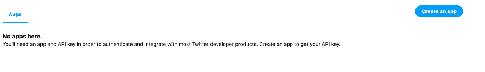

# Twitter-Bot
Simple twitter bot that retweets tweets from specified list of users. 

## Steps Followed:
- Create a Twitter Application:
This can be done at https://apps.twitter.com/. Click on the “Create New App” button and fill in the required information.


In the “Keys and Access Tokens” tab, make sure to note these four things:

- Consumer Key
- Consumer Secret
- Access Token Key
- Access Token Secret

Then Install Node.js here: https://nodejs.org/en/

In terminal, run command: ```npm init```.
Fill in the required information which will include: package name, version, description, entry point, etc. 

After doing that, run:
```
npm install twit --save
```
Now, create a file in that (same) directory called index.js

In a blank text editor, I created a Twit instance that can be used to make requests to Twitter's APIs. Learned how here: https://github.com/ttezel/twit

```
var Twit = require('twit')
var T = new Twit({
    consumer_key:         ' ... ',
    consumer_secret:      ' ... ',
    access_token:         ' ... ',
    access_token_secret:  ' ... ',
})
```
Fill in the blanks with the access keys you received earlier. 

Then, I created an array of users to retweet:
These are the Twitter ID's of: Train, Serena Williams, Michelle Obama, Beyonce, the National Science Foundation and WeRateDogs.
```
var users = ["26589987", "409486555", "31239408", "2463721", "16245822","4196983835",];
```
*You can obtain twitter ID's by going here: http://gettwitterid.com/?user_name=nsf&submit=GET+USER+ID

Then, create a stream ( ``` T.stream(path, [params])```). This keeps the connection between our app and the API alive. 
```
var stream = T.stream('statuses/filter', {follow: users});
```
More here about streams: https://developer.twitter.com/en/docs/tutorials/consuming-streaming-data.html

'tweet' is an event emitted each time a status (tweet) comes into the stream.

``` stream.on('tweet', function (tweet) {
    if (users.indexOf(tweet.user.id_str) > -1) {
        console.log(tweet.user.name + ": " + tweet.text);
        T.post('statuses/retweet/:id', { id: tweet.id_str }, function (err, data, response) {
            console.log(data)
        })
    }
})
```
The second line checks that the user who tweeted is in our array of ```users```. 
The fourth line uses twit to retweet the tweet with an id of tweet.id_str.

To execute, run: ```node index.js```.
For now, it has to be run locally on your machine 24/7.
